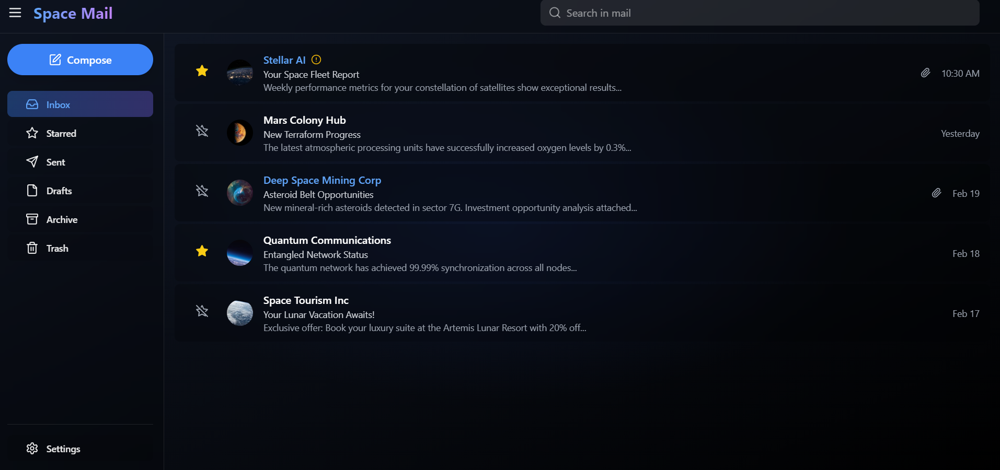

# Mail-3D: Modern Email Client with 3D Interface

A modern, interactive email client built with React, TypeScript, and Three.js, featuring a stunning 3D interface and smooth animations.



## 🚀 Features

- **3D Visual Interface**: Unique email visualization using Three.js
- **Modern UI**: Clean and responsive design with TailwindCSS
- **Interactive Compose**: Full-featured email composition with:
  - Rich text editing
  - File attachments
  - Email validation
  - Minimize/Maximize functionality
- **Smooth Animations**: Powered by Framer Motion
- **Type-Safe**: Built with TypeScript for robust code quality

## 🛠️ Tech Stack

- React 18
- TypeScript
- Three.js with React Three Fiber/Drei
- TailwindCSS
- Framer Motion
- Vite

## 📦 Installation

1. Clone the repository:
```bash
git clone https://github.com/yourusername/mail-3d.git
cd mail-3d
```

2. Install dependencies:
```bash
npm install
```

3. Start the development server:
```bash
npm run dev
```

4. Open [http://localhost:5173](http://localhost:5173) in your browser

## 🏗️ Project Structure

```
src/
├── components/
│   ├── Background/    # 3D background elements
│   ├── Email/         # Email-related components
│   ├── Layout/        # Layout components
│   └── UI/           # Reusable UI components
├── data/             # Sample data and configurations
├── types/            # TypeScript type definitions
├── App.tsx          # Main application component
├── main.tsx         # Application entry point
└── index.css        # Global styles
```

## 🎮 Usage

1. **Compose Email**: Click the compose button to open the email editor
2. **Attachments**: Click the paperclip icon to add files
3. **Minimize/Maximize**: Use the window controls to adjust the compose window
4. **Send Email**: Fill in the required fields and click Send

## 🤝 Contributing

1. Fork the repository
2. Create your feature branch (`git checkout -b feature/AmazingFeature`)
3. Commit your changes (`git commit -m 'Add some AmazingFeature'`)
4. Push to the branch (`git push origin feature/AmazingFeature`)
5. Open a Pull Request

## 📝 License

This project is licensed under the MIT License - see the [LICENSE](LICENSE) file for details.

## 🙏 Acknowledgments

- Three.js for 3D graphics
- React Three Fiber team
- Framer Motion for animations
- TailwindCSS for styling

## 📧 Contact

Your Name - [@yourtwitter](https://twitter.com/yourtwitter)

Project Link: [https://github.com/yourusername/mail-3d](https://github.com/yourusername/mail-3d)
